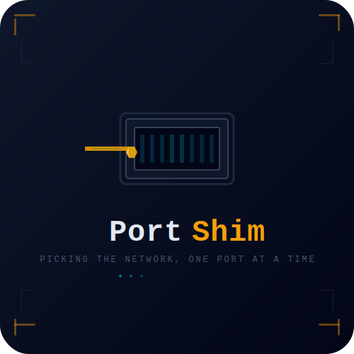

<div align="center">
  
  <h1 align="center">PortShim</h1>
  <p align="center">
    <strong>Picking the network, one port at a time.</strong>
  </p>
  <p align="center">
    An on-site pentest pipeline for authorised security professionals.<br>
    Air-gapped · LLM-powered · No trace left behind.
  </p>
  <p align="center">
    <a href="https://ozdemir-mehmet.github.io/portshim/">Website</a>
    ·
    <a href="#quick-start">Quick Start</a>
    ·
    <a href="#benchmarks">Benchmarks</a>
    ·
    <a href="#license">License</a>
  </p>
</div>

<br>

## Overview

PortShim is a **6-phase penetration testing pipeline** designed for on-site, air-gapped operations. Instead of relying on cloud LLMs, it runs fully on a local GPU via llama.cpp, with per-phase model selection so you're never using a slow model for a fast task — and never using a censored model for an exploit phase.

The name is a double entendre: in lockpicking, a *shim* is a thin tool that bypasses wafer locks; in networking, a shim sits between layers to intercept or modify traffic. **PortShim picks the network.**

## The 6 Phases

| # | Phase | Model | Purpose |
|---|-------|-------|---------|
| 0 | Scope & Setup | Any | Bootstrap, sync knowledge, configure engagement profile |
| 1 | Reconnaissance | Qwen3-Coder 30B | nmap sweep, device classification, topology mapping |
| 2 | Vulnerability Analysis | Qwen3-Coder 30B | CVE cross-reference, CVSS scoring, nuclei scanning |
| 3 | Exploitation | SuperGemma4 26B | Verify exploits, escalate, lateral movement |
| 4 | Reporting | SuperGemma4 26B | DOCX / PPTX / PDF / XLSX deliverables |
| 5 | Retest | Any | Re-scan, classify fix status, diff baseline vs retest |

## Requirements

- **GPU:** AMD Radeon 8060S / NVIDIA RTX 3090+ (24 GB VRAM)
- **RAM:** 64 GB recommended
- **Storage:** 50 GB+ free for models
- **Engine:** llama.cpp b9870+ (Vulkan or CUDA)
- **Python:** 3.11+

## Engagement Profiles

PortShim uses three noise profiles (quietest → loudest) to control how aggressively tools probe targets:

| Profile | Nmap | Nuclei | Brute Force | Use When |
|---|---|---|---|---|
| **Silent Entry** | -T1 -sT, 30s delay | Disabled | Disabled | IDS/IPS active, stealth required |
| **Surgical** (default) | -T3 -sS | critical+high only | Common creds | Balanced assessment |
| **Full Assault** | -T5 -sS -A | all severities | Full wordlists | No IDS, lab, time-critical |

Select: `python scripts/engagement-profiles.py <profile>`

## Quick Start

### Deploy
```bash
git clone https://github.com/ozdemir-mehmet/project-diamond
cd project-diamond
python deploy.py                    # System deps + Go tools + Python + exploit tools (hydra, sshpass, paramiko)
python deploy.py --with-msf         # Optional: also install Metasploit (1GB+)
```

### Start the server
```bash
# Start llama-server with Vulkan GPU offload
python diamond server start --model qwen3-coder-30b-a3b-instruct

# Server lifecycle
python diamond server status        # Check running/stopped, model, PID
python diamond server restart       # Switch models
python diamond server stop          # Graceful shutdown
python diamond server models        # List available GGUF files
```

### Run an engagement
```bash
# One-command engagement start
python diamond scan 10.0.0.0/22                           # Default: surgical + hybrid
python diamond scan 10.0.0.0/22 --engagement full-assault # Loud profile
python diamond scan 10.0.0.0/22 --mode local              # Air-gapped (local LLM only)
python diamond scan 10.0.0.0/22 --dry-run                  # Preview only
```

### Generate reports
```bash
python diamond configure llm local --output-dir ./configs/
python skills/site-assessment-pipeline/scripts/report-gen.py \
  outputs/phase4-findings.json --output-dir outputs/reports --format all
# Produces: report.docx, brief.pptx, report.pdf, checklist.xlsx
```

## Benchmarks

All on AMD Radeon 8060S, llama.cpp b9870 Vulkan, Q4_K_M quant:

| Model | PP tok/s | TG tok/s | Size | Role |
|-------|----------|----------|------|------|
| **Qwen3-Coder 30B (A3B)** | 447.5 | 82.7 | 17.3 GB | Recon, CVE analysis, general |
| **SuperGemma4 26B (A4B)** | 525.4 | 59.6 | 15.6 GB | Exploit, reporting |
| **HauhauCS 35B (A3B)** | 481.0 | 71.6 | 18.5 GB | Alternative exploit (PARTIAL on Phase 3) |

## Key Learnings

- **Gate 1 host summaries must use structured XML** (`topology.py --gate1`) — raw terminal output truncates and hides hosts.
- **"Uncensored" labels don't predict exploit quality.** HauhauCS 35B scored PARTIAL on Phase 3 despite being labelled "aggressive uncensored" — Qwen3-Coder 30B and SuperGemma4 26B both passed fully.
- **Lightweight exploit tools** (hydra, sshpass, paramiko) are included in the base deploy. Metasploit is optional via `--with-msf`.
- **PDF reports** use weasyprint — pure Python, no LibreOffice needed.

## License

Apache 2.0 — use it, modify it, share it. Authorised security testing only.

---

<p align="center">
  <sub>Built with <a href="https://github.com/ggml-org/llama.cpp">llama.cpp</a> · Powered by Vulkan · Backed by benchmarks</sub>
</p>
